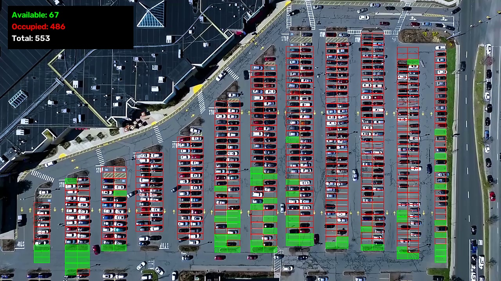
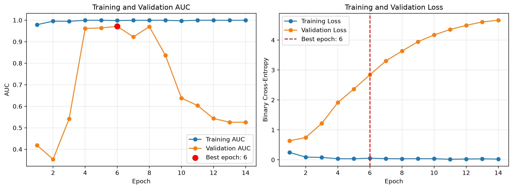
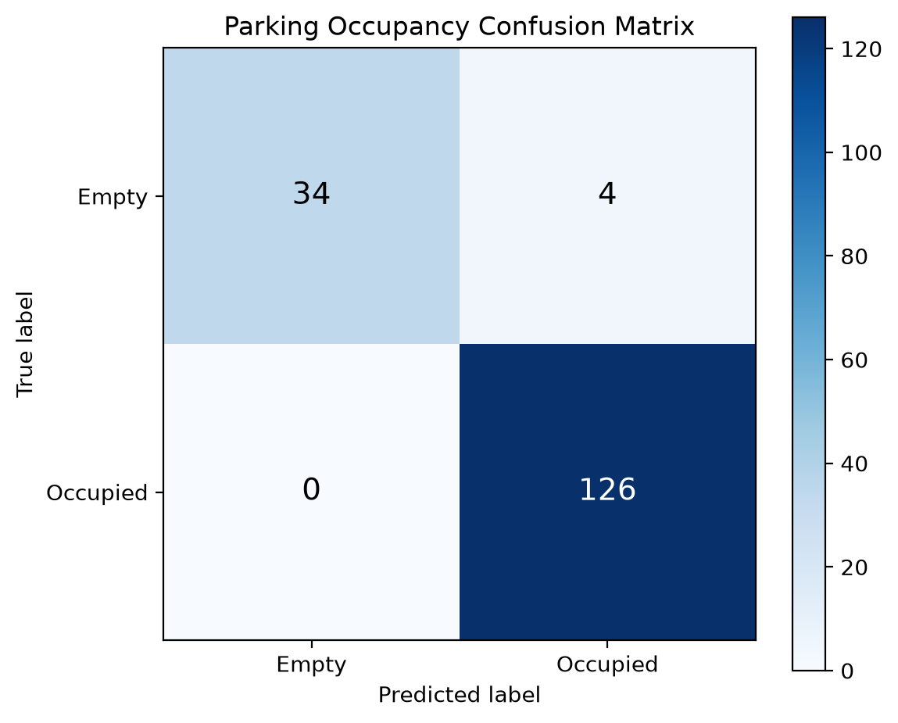
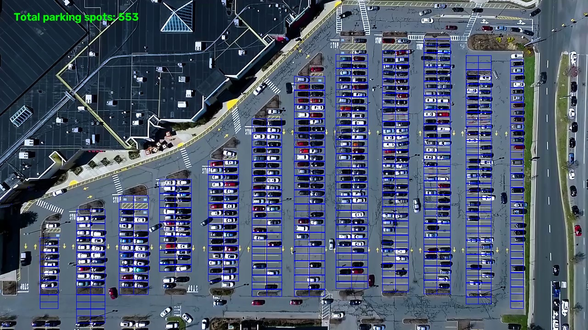
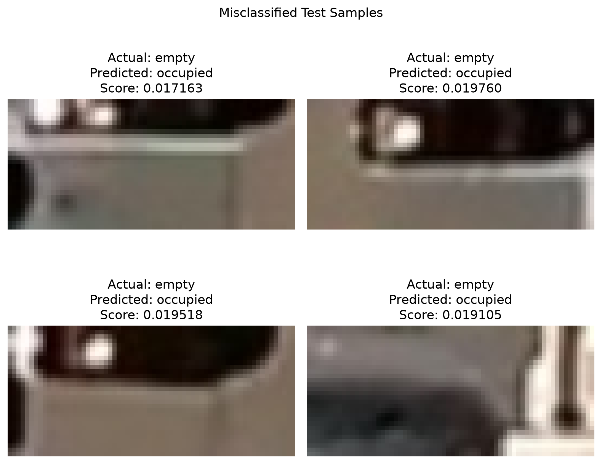

# Parking Occupancy Recognition

An end-to-end fixed-camera parking occupancy system. Python and TensorFlow/Keras
handle data preparation and model training; a C++17 application uses OpenCV and
ONNX Runtime for video inference. The project detects parking-lane geometry,
generates 553 parking-space coordinates, classifies each space as empty or
occupied, and renders the results on a complete parking-lot video.



## Highlights

- Processes the original 1280 x 720, 23.976 FPS parking video from start to
  finish.
- Detects parking-lane structure with brightness filtering, Canny edges,
  region-of-interest masking, and probabilistic Hough transforms.
- Produces a reusable JSON configuration containing 553 parking spaces.
- Uses a compact CNN with augmentation and class weighting for empty/occupied
  classification.
- Selects the operating threshold using validation-set balanced accuracy while
  keeping the test split isolated.
- Runs faster than real time on CPU by batching all 553 crops and updating
  occupancy once per second.
- Saves an annotated video and optionally displays the result in an OpenCV
  window. Press `Q` to stop the live display.
- Includes a C++17 inference path that processes the complete video and records
  occupancy state changes.

## Results

The reported test split contains 164 images from the same fixed-camera domain
as the training data.

| Metric | Result |
| --- | ---: |
| Test accuracy | 97.56% |
| Balanced accuracy | 94.74% |
| Precision | 96.92% |
| Recall | 100.00% |
| Specificity | 89.47% |
| F1 score | 98.44% |
| ROC AUC | 98.74% |
| Confusion matrix | TN 34, FP 4, FN 0, TP 126 |
| Decision threshold | 0.017098 |

CPU video benchmark:

| Measurement | Result |
| --- | ---: |
| Parking spaces per inference batch | 553 |
| Mean batch inference time | 102.55 ms |
| Occupancy update interval | 24 frames, approximately 1 second |
| End-to-end processing speed | 68.97 FPS |
| Source video frame rate | 23.976 FPS |

The benchmark was measured with TensorFlow 2.21 on native Windows CPU. A GPU
is not required for real-time processing in this configuration.

| Training history | Test confusion matrix |
| --- | --- |
|  |  |

## Pipeline

```mermaid
flowchart LR
    A[Parking video] --> B[Representative frames]
    B --> C[ROI and edge preprocessing]
    C --> D[Hough line detection]
    D --> E[Lane clustering and calibration]
    E --> F[553 parking-space coordinates]
    F --> G[Crop and resize each space]
    G --> H[Lightweight CNN]
    H --> I[Validation-calibrated threshold]
    I --> J[Annotated video and occupancy counts]
```



The coordinate stage is performed once for a fixed camera. The generated
coordinates are validated on six frames sampled across the video before being
used for training and inference.



## Dataset

The project includes 545 labeled parking-space crops:

| Split | Empty | Occupied | Total |
| --- | ---: | ---: | ---: |
| Development directory | 96 | 285 | 381 |
| Independent test set | 38 | 126 | 164 |
| Total | 134 | 411 | 545 |

The 381 development images are deterministically divided into 305 training
images and 76 validation images with a fixed random seed. Dataset inspection
checks image readability, dimensions, class distribution, and exact duplicate
files across splits.

## Model

The classifier uses three convolution blocks:

1. `Conv2D(32) -> BatchNorm -> ReLU -> MaxPool`
2. `Conv2D(64) -> BatchNorm -> ReLU -> MaxPool`
3. `Conv2D(128) -> BatchNorm -> ReLU -> MaxPool`
4. `GlobalAveragePooling -> Dense(64) -> Dropout(0.30) -> Sigmoid`

Training uses horizontal flips, translation, zoom, and small rotations.
Inverse-frequency class weights reduce bias toward the majority occupied
class. The best checkpoint is selected by validation AUC.

The raw sigmoid scores are well ranked but are not calibrated around the
default 0.5 decision boundary. The project therefore selects a threshold on
the validation split by maximizing balanced accuracy, then applies the frozen
threshold once to the independent test split.

## Error Analysis

Four of 164 test crops are misclassified. All four are false positives: empty
spaces predicted as occupied. These borderline crops contain neighboring
vehicle edges, shadows, or strong highlights. For parking guidance this is a
conservative failure mode because it under-reports availability instead of
directing a driver to an occupied space.



## Repository Structure

```text
parking-occupancy-recognition/
|-- checkpoints/                    # Best Keras checkpoint
|-- configs/                        # Parking coordinates and decision threshold
|-- data/
|   |-- interim/frames/             # Representative video frames
|   `-- raw/
|       |-- parking_spots/          # Labeled empty/occupied crops
|       `-- videos/                 # Source parking video
|-- results/
|   |-- coordinate_detection/       # Coordinate-generation stages
|   |-- coordinate_validation/      # Cross-frame coordinate checks
|   |-- evaluation/                 # Metrics, errors, and confusion matrix
|   |-- inference/                  # Images and annotated videos
|   `-- training/                   # History and training curves
|-- detect_parking_lines.py
|-- generate_parking_spots.py
|-- train_classifier.py
|-- evaluate_classifier.py
|-- predict_frame.py
|-- run_video_inference.py
`-- cpp/                            # C++17 / OpenCV / ONNX Runtime inference
```

## Installation

Python 3.12 is recommended.

```bash
python -m venv .venv
.venv\Scripts\activate
python -m pip install --upgrade pip
pip install -r requirements.txt
```

TensorFlow 2.11 and later use CPU on native Windows. The included model and
video pipeline already run faster than the source frame rate on CPU.

## Usage

Inspect the source video:

```bash
python inspect_video.py
```

Rebuild and validate parking coordinates:

```bash
python extract_frames.py
python detect_parking_lines.py
python generate_parking_spots.py
python validate_parking_coordinates.py
```

Inspect the classification dataset and train the CNN:

```bash
python inspect_dataset.py
python train_classifier.py
```

Evaluate the model and create analysis figures:

```bash
python evaluate_classifier.py
python plot_confusion_matrix.py
python plot_training_history.py
python analyze_errors.py
```

Run inference on a representative frame:

```bash
python predict_frame.py
```

Run full-video inference:

```bash
python run_video_inference.py
```

The complete annotated output is saved locally to
`results/inference/parking_occupancy_result.mp4` and is ignored by Git.
The curated, complete video published with this repository is `docs/demo.mp4`.
Set `DISPLAY_WINDOW = True` in `run_video_inference.py` to display the video
during processing; press `Q` to stop.

## C++ video deployment (Ubuntu / WSL)

The C++ program reuses the 553-space configuration and the exported ONNX
classifier. From the repository root in Ubuntu or WSL, install the development
libraries, configure a Release build, and run the complete video:

```bash
sudo apt install build-essential cmake libopencv-dev nlohmann-json3-dev libonnxruntime-dev
cmake -S cpp -B cpp/build -DCMAKE_BUILD_TYPE=Release
cmake --build cpp/build --target run_video_cpp -j2
./cpp/build/run_video_cpp data/raw/videos/parking_video.mp4 results/inference/cpp/parking_occupancy_cpp.mp4
```

The exported model is included at `checkpoints/best_parking_classifier.onnx`; to
regenerate it from the Keras checkpoint, run `python export_onnx.py` in the
TensorFlow environment after moving the existing ONNX file aside. Run the
executable from the repository root because its model and configuration paths
are relative to the current directory. It writes an annotated MP4, a sibling
`.events.jsonl` file containing occupancy state changes, and a sibling
`.stats.json` file. The first valid prediction establishes the initial state;
later events include the frame index, video time, spot ID, old/new state, and
occupied score. Existing output files are never overwritten; choose a new
output filename for another run. `docs/demo.mp4` is protected.

On the included 1452-frame, 1280 x 720 video, a WSL2 Ubuntu 26.04.1 Release
build using OpenCV 4.10.0 and ONNX Runtime 1.23.2 processed all frames, ran
60 batches of 553 spaces, and emitted 617 state-change events. The measured
frame-loop speed was 96.55 FPS with 61.97 ms mean batch inference time on an
Intel Core Ultra 7 255HX CPU. These are C++ measurements, separate from the
TensorFlow/Windows benchmark above. The generated video was decoded through
all 1452 frames; the event JSONL and statistics JSON were parsed successfully.
On representative frame 001410, Keras and C++ agreed on all 553 occupancy
classes with a maximum score difference of 8.57e-8.

- [Download the 10-second annotated preview](results/inference/parking_occupancy_preview.mp4)
- [Download the complete annotated demo](docs/demo.mp4)

## Design Decisions

- **Fixed coordinate map:** the camera is static, so parking coordinates are
  generated once and reused rather than detected on every frame.
- **Periodic inference:** parking occupancy changes slowly, so the CNN runs
  once every 24 frames and the latest result is rendered between updates.
- **Batch prediction:** all 553 parking crops are submitted together to reduce
  per-call overhead.
- **Conservative errors:** the selected threshold produced zero false negatives
  on the test split and four false positives.

## Limitations

- Coordinates are calibrated for the included fixed camera and must be
  regenerated for another viewpoint.
- Training and test images come from the same parking-lot domain; the reported
  metrics do not establish cross-camera or cross-weather generalization.
- The labeled dataset is small and class imbalanced.
- The operating threshold is model-specific and should be recalibrated after
  retraining or changing the deployment domain.
- The tested Ubuntu ONNX Runtime package prints duplicate ONNX schema
  registration diagnostics when the C++ program starts. This run completed,
  and the representative frame had zero Python/C++ class mismatches; the
  startup diagnostics have not yet been eliminated.

## License

The project code is released under the [MIT License](LICENSE).
